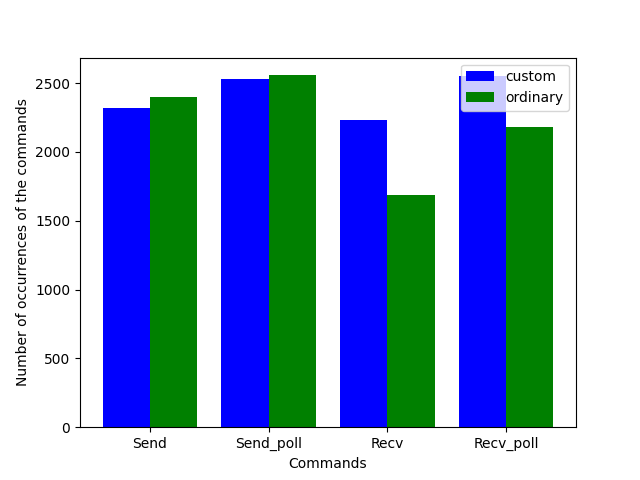

# Statistics about program generators

This is a comparison between ordinary program generators and custom
program generators.  When generating test inputs for `STM` (and `Lin`
for that matter), we generate a triplet of list of commands: a
sequential prefix and two concurrent processes. If commands in the
tested API have some preconditions, we want to avoid generating test
inputs that behave badly because of the no respect of these
preconditions.

Preconditions are expressed by predicates over a state, a state being
a functional model of the system under test.

In a sequential setting, we can easily make the generator depends on
the state, making it only generating sequences of commands that
respect the command's precondtions at every step of the program. In a
concurrent setting, the situation is a bit more delicate as we don't
know a priori how the commands of the two concurrent suffixes will
interleave.

The ordinary generator takes on generate-and-filter approach,
generating a triplet of list of commands and then checking whether the
preconditions are repsected in all the possible interleavings.

In contrast, the custom generator aims at generating only triplets
that represent a valid program precondition-wise.

So, the ordinary generator will generate a certain amount of programs
that it will then throw away while the custom generator will spend
more time generating only valid programs.

The overall result is that the custom generator is twice as much
costly in time than the oridinary one and does not detect as much
easily bugs.

**plan**


In order to test and measure the behaviour of the two kinds of
generator, we use the library `Domainslib.Chan`.

## Length and commands distribution

We want generators that are comparable, that is generators that ouptut
the same kind of programs at least in term of length and in term of
commands distribution.

After tweeking a bit the custom generator, we manage to have a relatively
satisfying result.

We have generated one thousand valid programs using both generators
with a maximum length of the concurrent suffixes put at 10 and
measured the sum of the length of the generated concurrent
suffixes. This gives us the following graph:

<div align="center">

</div>

We can see that except for the smaller length, both generators have
the same chance of generating a program of this length and that they
both generate more smaller programs than bigger ones.

With the same process, we have measured the repartition of the
commands in the concurrent suffixes of the generated programs. Here
again, the two generators behaves relatively the same. This gives us
the following graph:

<div align="center">

</div>

Here again, we can see that the commands' repartition is quite similar
using these two generators.

## Bug finding abilities

Once we know that both generators will output some relatively similar
input tests, we can wonder whether they behave the same with respect
to bug finding abilities.

In order to measure that, we use `QCheck` to test the property
provided by `STM` with 10000 test inputs with a slight modification:
the property that we test always returns `true` but, as a side effect,
increment a counter each time the program is not linearizable
according to `STM`. That way, the test process does not stop at the
first founded bug and we are able to count the number of time we find
a bug in the 10000 test inputs.

```bash
$ dune exec ./ratio.exe
random seed: 28744359
================================================================================
success (ran 2 tests)
Buggy programs with custom generator:  2729 / 10_000
Buggy programs with ordinay generator: 4215 / 10_000
```

Here we can see that the the custom generator have lesser bug finding
abilities than the ordinary one. At the present moment, we are not
quite sure why.

We then test for the statistical significance of this difference, and
it seems that this is not a significant difference.

```bash
$ dune exec ../src/statistics/z_test.exe 2779 10000 4215 10000
Entering directory '/home/nicolas/git/multicoretests'
z-test of two proportions
z = -nan
Is |z| = |-nan| > z_alpha2 = 1.960000 ?
No, failed to reject null hypothesis
```

## Speed

Now, we want to determine whether the custom generator is cheaper in terms of
time than the ordinary one that is generating a lot of inputs just to throw them away.

To measure the time spent generating test inputs we make both generators
generate one thousand valid programs with a maximum length of concurrent suffixes 
put at 10. We then use `hyperfine` to benchmark these two generators.

```bash
$ hyperfine "dune exec -- ./thousand.exe ordinary" "dune exec -- ./thousand.exe custom"
Benchmark 1: dune exec -- ./thousand.exe ordinary
  Time (mean ± σ):     649.2 ms ±  71.9 ms    [User: 623.6 ms, System: 12.3 ms]
  Range (min … max):   569.9 ms … 821.5 ms    10 runs

Benchmark 2: dune exec -- ./thousand.exe custom
  Time (mean ± σ):     996.9 ms ±  87.2 ms    [User: 970.4 ms, System: 10.9 ms]
  Range (min … max):   886.0 ms … 1106.6 ms    10 runs

Summary
  'dune exec -- ./thousand.exe ordinary' ran
    1.54 ± 0.22 times faster than 'dune exec -- ./thousand.exe custom'
```
We can see that the ordinary generator is still faster than the custom one.

## What's next?

- see if we can make the custom generator a bit faster by sparing some
  `next_state` computation
- measure the evolution of the difference in time with other length of
  concurrent suffixes (as there is a difference in complexity, the
  custom generator could end up faster with smaller programs)
